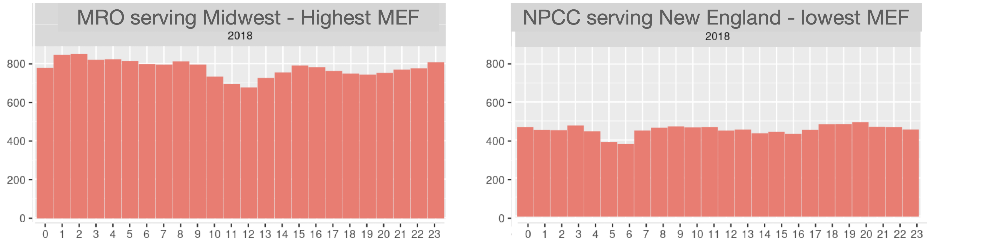

## Ensuring greenhouse gas reductions from electric vehicles compared to hybrid gasoline vehicles requires a cleaner U.S. electricity grid.

Emissions from electric vehicles depend on ambient conditions and when and where they are charged. Ambient conditions like temperature and drive cycle influence vehicle efficiency, while the carbon intensity of the power plants used to charge the
vehicle differs by location and time of charging. In this work, we:

1) Introduce Critical Emissions Factors (CEFs), defined as the electricity emissions intensity that needs to be achieved during charging to ensure that electric vehicles achieve lifecycle greenhouse gas emissions parity with some of the most efficient gasoline hybrids in the United States

2) Identify regions that have achieved the required CEFs for vehicle pairs and regions that will require further emissions reductions

3) Update previous results of comparative lifecycle emissions between electric vehicles and gasoline hybrids as presented in Yuksel et al. (cite) using new data

Figure 1 shows the dependence of electric vehicle efficiency on temperature (20F, 72F, 95F) and drive cycle. UDDS and HWFET drive cycles approximate urban and highway driving. Temperature affects both the battery performance, in the case of EVs, as well as increases overall vehicle energy required for heating, ventilation, and air conditioning during high and low temperatures. Gasoline hybrids are more sensitive to drive cycles than electric vehicles.

